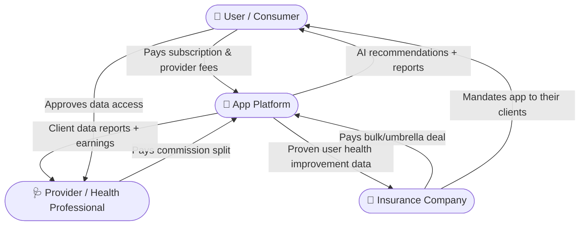
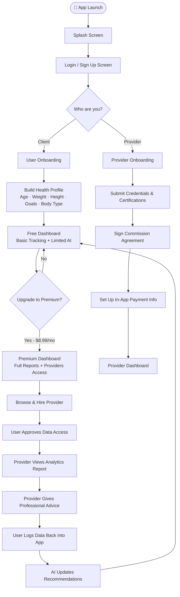
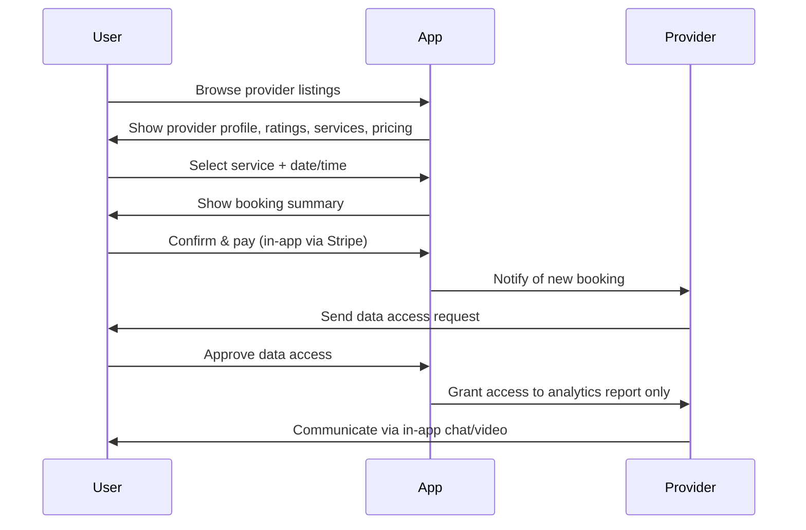
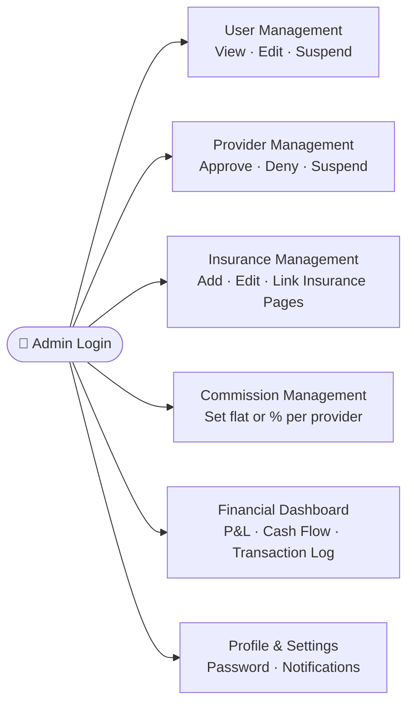
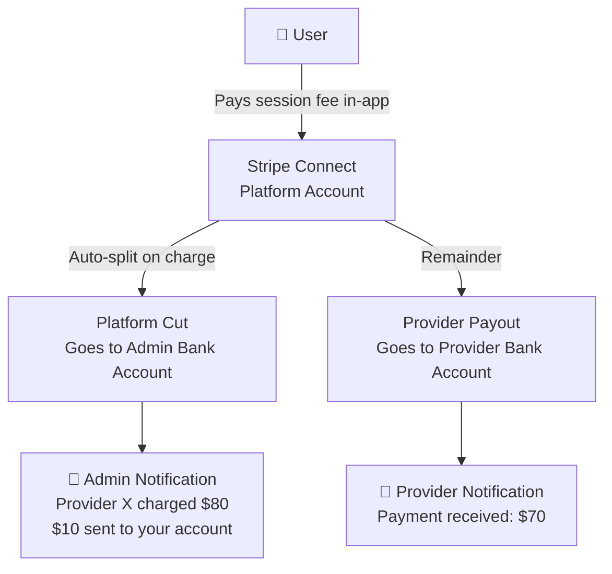
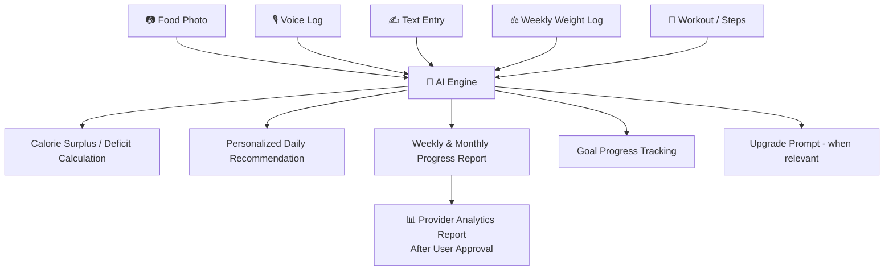
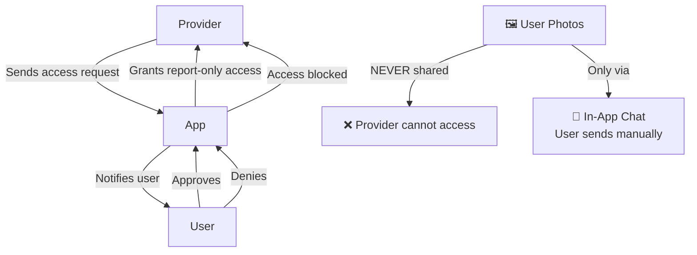

# Health & Wellness App — Meeting Overview
**Client:** Dr. Armbrister, Ph.D.
**Type:** Design Review & Requirements Alignment
**Status:** Pre-Development — Mockup Review Stage

---

## Table of Contents
1. [App Vision](#app-vision)
2. [Three-Player Ecosystem](#three-player-ecosystem)
3. [App Flow Overview](#app-flow-overview)
4. [User Flow](#user-flow)
5. [Provider Flow](#provider-flow)
6. [Admin Flow](#admin-flow)
7. [In-App Payment System (Stripe)](#in-app-payment-system-stripe)
8. [AI Interaction & Data Engine](#ai-interaction--data-engine)
9. [Privacy & Data Access Rules](#privacy--data-access-rules)
10. [Revenue Model](#revenue-model)
11. [Key Feature Requirements](#key-feature-requirements)
12. [Action Items](#action-items)

---

## App Vision

The app is a **health management platform** that bridges three parties — individual users, health/wellness providers, and insurance companies — through a single, secure, data-driven ecosystem.

It functions like a fitness app, a marketplace (similar to Fiverr), and a health analytics engine — all in one. The AI continuously learns from the user's input and provides personalized recommendations. As users progress, they upgrade to premium and gain access to professional providers. The data collected becomes a valuable asset for providers and insurance companies.

---

## Three-Player Ecosystem

---

## App Flow Overview

---

## User Flow

### Onboarding & Profile Setup
- Splash screen → Login / Sign up (email or Google)
- Forgot password / Reset password option
- **Health Profile Setup (mandatory):**
  - Full name, age, height, weight
  - Body type, average fat level
  - Health conditions (e.g., diabetes, high blood pressure)
  - Short-term goal (e.g., lose 15 lbs in 3 months)
  - Long-term goal (e.g., reduce belly fat, lower sugar levels)
  - User can type or speak goals to AI
- Optional: Take a body photo at signup *(privacy notice displayed prominently)*

### Free Dashboard
| Feature | Description |
|---|---|
| Health Score | Overall score based on logged inputs |
| Daily Tracking | Steps, mood, energy, stress, sleep, hunger, cravings |
| Nutrition Tracking | Calories, protein, water, carbs, fat |
| AI Recommendations | 1 recommendation/day |
| Food Logging | Via camera, voice, or text — AI detects & calculates calories |
| Weekly Prompt | Pop-up: "Log your weight & measurements" |

### Premium Dashboard ($8.99/month)
- Everything in free, plus:
- 5–10 AI recommendations/day
- Full weekly & monthly data reports
- Access to all health providers
- Full calorie surplus/deficit analysis
- Progress tracking with charts (daily / weekly / monthly)

### Booking a Provider

---

## Provider Flow

### Registration & Setup
- Select "Provider" on entry screen
- Fill professional profile:
  - Specialization, location, bio/description
  - Upload driver's license & medical certificates
  - Profile photo
- **Set up in-app payment information** (bank details — handled via Stripe Connect, all within the app)
- Sign commission agreement with platform (percentage or flat fee per client)
- Submit for admin approval

### Provider Dashboard
| Section | Details |
|---|---|
| Overview | Total appointments, upcoming sessions, ratings, total earnings |
| Client List | All active clients with booking history |
| Client Report View | Analytics report (calories, weight trend, health score, etc.) — only after user approval |
| Services Management | Add/edit services, set pricing and session duration |
| Schedule | Set weekly availability |
| Communication | In-app chat, video calls, screen sharing |
| Earnings | Real-time earnings tracker, commission breakdown |

---

## Admin Flow

### Admin Dashboard
- Total users, providers, insurance partners, revenue overview
- Revenue charts (daily / weekly / monthly)
- Recent signups

### Admin Controls

### Commission Management (Per Provider)
- Admin can set individually per provider:
  - **Flat fee** (e.g., $50 per client referred)
  - **Percentage split** (e.g., 10% of session charge)
- Default commission rate can be set globally; individual overrides allowed
- Provider sees and agrees to their specific split during onboarding

---

## In-App Payment System (Stripe)

> **Core Requirement:** All payment flows must happen **inside the app**. No redirects to external pages.

### Architecture: Stripe Connect

### User Payment Flow
1. User adds credit card on file during premium signup
2. Recurring monthly subscription charged automatically
3. When booking a provider — use card on file or add new card
4. Accepted methods: Credit/Debit Card, Apple Pay, Google Pay, PayPal

### Provider Payment Flow
1. Provider enters bank account details during registration (in-app)
2. Signs commission agreement (e-signature in-app)
3. When a session is completed → Stripe auto-splits the payment:
   - Provider receives their agreed portion
   - Platform fee automatically transferred to admin's linked bank account
4. Both parties receive real-time notifications

### Admin Financial Controls
- Link admin bank account via Stripe dashboard (one-time setup)
- View all transactions in admin panel
- Set per-provider commission (flat or %)
- Export P&L and cash flow reports
- Receive notification for every completed transaction

### Insurance Payments
- Insurance transactions currently happen **outside the app** (user is redirected to the insurance company's official website)
- Reason: Platform does not hold an insurance license
- Future plan: Bring insurance transactions in-app once licensed

---

## AI Interaction & Data Engine

**Example AI Logic:**
- User profile: 42 years old, 5'7", 192 lbs, goal: reach 185 lbs in 3 months
- Daily calorie target: ~2,000 kcal
- User logs dinner: 3,200 kcal
- AI response: *"You had a 1,200 calorie surplus today. Tomorrow, aim for 1,800 kcal to stay on track."*
- Weekly: If user consistently under-eats by 200 kcal/day → AI projects ~2 lb weight loss over the month

---

## Privacy & Data Access Rules

**Rules:**
- Provider can **only** access analytics/reports — never photo albums
- Every data input screen displays a privacy notice (fine print at bottom)
- First onboarding screen: bold security guarantee message
- User must explicitly approve provider access before any data is shared
- Photos shared only if the user manually sends them via in-app chat
- All communication is logged and controlled through the app

---

## Revenue Model

| Stream | Source | How |
|---|---|---|
| **User Subscriptions** | Individual users | $8.99/month (recurring, via Stripe) |
| **Provider Commission** | Health professionals | Flat fee or % per client — agreed per provider |
| **Insurance Deals** | Insurance companies | Bulk/umbrella deals — platform sells aggregated (anonymized) health improvement data |

---

## Key Feature Requirements

| Feature | Priority | Notes |
|---|---|---|
| Health profile with goal setup | 🔴 High | Must include at signup |
| AI calorie & health engine | 🔴 High | Core of the app |
| In-app Stripe payment (no redirects) | 🔴 High | Stripe Connect recommended |
| Provider data access approval flow | 🔴 High | Compliance-critical |
| Weekly weight/measurement prompt | 🟡 Medium | Push notification |
| Premium upgrade flow | 🔴 High | Triggers at right moments |
| Commission management in admin | 🔴 High | Per-provider flat or % |
| In-app video/chat communication | 🟡 Medium | Provider ↔ User only |
| Review system → social media post | 🟢 Future | Facebook & Instagram integration |
| Body photo at onboarding (optional) | 🟡 Medium | With strong privacy notice |
| Admin P&L / cash flow reports | 🟡 Medium | Financial overview for admin |

---

## Action Items

| # | Task | Notes |
|---|---|---|
| 1 | Add health onboarding pages (age, weight, goals, body photo) | Add to user signup flow |
| 2 | Add premium upgrade flow | Trigger at right moments in UX |
| 3 | Implement in-app Stripe Connect payment | No external redirects |
| 4 | Build provider commission management in admin panel | Flat fee & percentage options |
| 5 | Build data access request/approval system | User approves → provider gets reports only |
| 6 | Prepare app feature "bible" document | Full written spec for all features |
| 7 | Share updated mockups with new pages | Target: Monday |
| 8 | Begin backend architecture & schema design | Payment, AI data model, access control |

---

*Document prepared based on client meeting with Dr. Armbrister, Ph.D.*
*Next milestone: Updated mockups + feature spec document by Monday*
